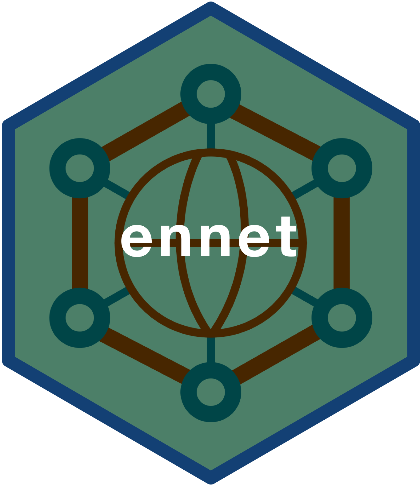

<!-- README.md is generated from README.Rmd. Please edit that file -->

```{r, include = FALSE}
knitr::opts_chunk$set(
  message = FALSE,
  warning = FALSE,
  error = FALSE,
  collapse = TRUE,
  comment = "#>",
  fig.path = "man/figures/README-",
  out.width = "100%"
)
```

# ennet: Utilities to Extract and Analyse Text Data From the Emergency Nutrition Network (en-net) Forum 

<!-- badges: start -->
[](https://www.tidyverse.org/lifecycle/#maturing)
[](https://CRAN.R-project.org/package=ennet)
[](https://cran.r-project.org/web/checks/check_results_ennet.html)
[](https://CRAN.R-project.org/package=ennet)
[](https://CRAN.R-project.org/package=ennet)
[](https://CRAN.R-project.org/package=ennet)
[](https://github.com/katilingban/ennet/actions)
[](https://github.com/katilingban/ennet/actions)
[](https://codecov.io/gh/katilingban/ennet?branch=master)
[](https://www.codefactor.io/repository/github/katilingban/ennet)
<!-- badges: end -->

[**en-net**](https://www.en-net.org) is the go to online forum for field practitioners requiring prompt technical advice for operational challenges for which answers are not readily accessible in current guidelines. The questions and the corresponding answers raised within [**en-net** online forum](https://www.en-net.org) can provide insight into what the key topics of discussion are within the nutrition sector. This package provides utility functions for the extraction, processing and analysis of text data from the online forum.

## What does `ennet` do?

The `ennet` package has three key sets of functions:

1. The first set of functions facilitates the extraction of text data from the [**en-net** online forum](https://www.en-net.org). 

2. The second set of functions supports the analysis of the extracted datasets to produce summary measures and statistics of the [**en-net** online forum](https://www.en-net.org).

3. The third set of functions consists of data handling and processing tools for use in the [en-net database](https://github.com/katilingban/ennet_db) called `ennet_db`.

## Installation

You can install the released version of rennet from [CRAN](https://CRAN.R-project.org) with:

```{r install, echo = TRUE, eval = FALSE}
install.packages("ennet")
```

You can install the development version from [GitHub](https://github.com/) with:

```{r install_github, echo = TRUE, eval = FALSE}
if(!require(remotes) install.packages("remotes"))
remotes::install_github("katilingban/ennet")
```

## Usage

### The `ennet` data extraction workflow

`ennet` package provides a set of functions that extracts information from the [**en-net** online forum](https://www.en-net.org). This set of functions was built on top of the [`rvest`](https://rvest.tidyverse.org) package which provides robust and performant web scraping functions and the [`dplyr`](https://dplyr.tidyverse.org) package which provides a full suite of data manipulation functions. The `ennet` package was designed to be able to interact with how the [**en-net** online forum](https://www.en-net.org) has been structured.

#### en-net website structure

The [**en-net** online forum](https://www.en-net.org) website has a very clear and clean structure. The opening page is a list of **thematic areas** which are linked to each of their respective webpages. In each of these **thematic area** webpages is another list, this time a list of **topics** raised within the **thematic area**. These **topics** are the text that an online user provides as the title for the question she/he is going to ask. Each of the **topics** are then again linked to their respective webpages that show the actual full question raised and the ensuing responses and **discussion** stemming from that question.

<br/>

<p align="center">
```{r ennet_structure, echo = FALSE, eval = TRUE, fig.align = "center"}
knitr::include_graphics("man/figures/ennet_structure.png")
```
</p>

<br/>

Based on this structure, the following functions are available from the `ennet` package for extracting text data:

* `get_themes` - function to get a list of thematic areas in the forum;

* `get_theme_topics` and `get_themes_topics` - functions to get list of topics for a specific thematic area or thematic areas; and,

* `get_topic_discussions` and `get_topics_discussions` - functions to get list of discussions for a specific topic or topics,

The general data extraction workflow codified by the `ennet` package is as follows:

```{r extract1, echo = TRUE, eval = FALSE}
## Step 1: Get the en-net forum themes
themes <- get_themes()

## Step 2: Get the en-net topics from each theme
topics <- get_themes_topics(themes)

## Step 3: Get the en-net discussions per topic per theme
discussions <- get_topics_discussions(topics)

## Show discussions data
discussions
```

The `ennet` package functions have been designed to allow for pipe operations to be performed. The data extraction workflow can be implemented using piped operations as follows:

```{r extract2, echo = TRUE, eval = FALSE}
get_themes() %>%            ## Step 1: Get en-net forum themes
  get_themes_topics() %>%   ## Step 2: Get en-net topics from each theme
  get_topics_discussions()  ## Step 3: Get en-net discussions per topic 
                            ##         per theme
```

For a more detailed discussion of the data extraction workflow via the `ennet` package, read [Utilities to Extract Text Data from en-net](https://katilingban.io/ennet/articles/extract.html).

### The `ennet` analytics functions

The `ennet` package also includes analytic functions that summarises the text data available from the [**en-net** online forum](https://www.en-net.org). Currently, there are four sets of analytic functions available from `ennet`:

* `count_topics_time` functions - set of functions to count the number of topics or questions by day, wee, month or year;

* `count_topics_theme` functions - set of functions to count the number of topics or questions by theme;

* `count_topics_author` functions - set of functions to count the number of topics or questions by author; and,

* `arrange` functions - set of functions to arrange topics by number of views or by number of replies.

For a more detailed discussion of the analytics functions available from the `ennet` package, read [Summarising en-net online forum statistics](https://katilingban.io/ennet/articles/analytics.html).

### The `ennet` database functions

The `ennet` package includes database functions designed for use with the [en-net database](https://github.com/katilingban/ennet_db) called `ennet_db`. These database functions support the retrieval, handling and processing of datasets from the [**en-net** online forum](https://www.en-net.org) archived in the `ennet_db`.

### Utilities and datasets

In addition to these two sets of key functions, `ennet` package also includes a function - `update_topics` - that extracts the [**en-net** online forum](https://www.en-net.org) dataset and updates it at a given time interval. This is a convenience wrapper function to `get_themes_topics` that is potentially useful for those who wants to build dashboards or applications that uses data from the [**en-net** online forum](https://www.en-net.org).

Two datasets are also included in the `en-net` package. The first dataset is a data.frame of [**en-net** online forum](https://www.en-net.org) themes and the second dataset is a data.frame of [**en-net** online forum](https://www.en-net.org) topics.

## Practical applications

The [**en-net**](https://www.en-net.org/) online forum is a rich resource for understanding the community of users that participate in it. And given how an online forum is designed, that resource can be tapped relatively easily given that the documentation of the interaction and discussion between its users happens in real-time. The `ennet` package facilitates the access to that information through the statistical analysis tool [R](https://cran.r-project.org) with which further levels of analysis can be applied to generate meaningful and valuable understanding of this specific community and to some extent the greater nutrition sector at large.

Following are a few practical and meaningful applications of the information generated by the [**en-net** online forum](https://www.en-net.org).

### Assess effectiveness of the en-net online forum 

The data from the [**en-net** online forum](https://www.en-net.org) can be used to assess effectiveness of the forum. Effectiveness can be defined as whether the forum has been able to achieve its stated aims/objectives when it was started. Effectiveness can also be expressed in terms of indicators or metrics that reflect overarching principles, ideals or values that those who started the forum adhere to or that the community of users and the wider sector or society believe in. These may include values of inclusion, participation, scientific rigour among others. Given that the forum has been in existence for many years now, information is available over the same period allowing for assessing temporal variation in effectiveness (as defined). This application is a more **normative approach** and will involve creating or developing metrics or taking relevant metrics from other sectors and applying those to this case. 

### Identify gaps in information, knowledge and/or skills

Given the nature of the [**en-net** online forum](https://www.en-net.org) as a quick point of recourse for field practitioners to seek answers to practical questions and challenges faced, it can be expected that the data from the forum contains information on what these topics are. These information can then be used to identify most common or most important information, knowledge and skills that have been asked about. By identifying these gaps in information, knowledge and/or skills and by understanding the evolution of these needs over time, we can potentially predict training needs in the near term and over time. This application is a more **formative approach** in that we let the data tell us what information it holds.

## Disclaimer

The `ennet` package is an independent development and is separate from and not recognised and approved by the *[Emergency Nutrition Network (ENN)](https://www.ennonline.net)*, the organisation that runs and moderates the [**en-net** online forum](https://www.en-net.org). The author and maintainer of this package is not affiliated with *[ENN](https://www.ennonline.net)* but is committed to ensuring that the `ennet` package is compliant with [**en-net** online forum](https://www.en-net.org)'s terms of use.

Any mistakes, problems and issues with the functionality and outputs of the `ennet` package are that of the author and maintainer of the package and not of *[Emergency Nutrition Network (ENN)](https://www.ennonline.net)*. Hence any problems and issues to the usage, functionality and outputs of the `ennet` package should be addressed directly to the author and maintainer [here](https://github.com/katilingban/ennet/issues).

## Community guidelines

Feedback, bug reports and feature requests are welcome; file issues or seek support [here](https://github.com/katilingban/ennet/issues). If you would like to contribute to the package, please see our [contributing guidelines](https://katilingban.io/ennet/CONTRIBUTING.html).

Please note that the `ennet` project is released with a [Contributor Code of Conduct](https://katilingban.io/ennet/CODE_OF_CONDUCT.html). By contributing to this project, you agree to abide by its terms.
