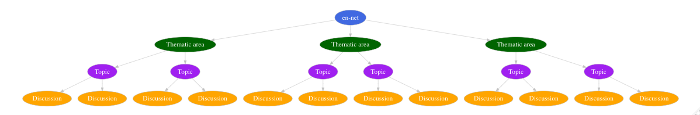

<!-- README.md is generated from README.Rmd. Please edit that file -->

# ennet: Utilities to Extract and Analyse Text Data From the Emergency Nutrition Network (en-net) Forum 

<!-- badges: start -->

[](https://www.tidyverse.org/lifecycle/#maturing)
[](https://github.com/katilingban/ennet/actions)
[](https://github.com/katilingban/ennet/actions)
[](https://codecov.io/gh/katilingban/ennet?branch=master)
[](https://www.codefactor.io/repository/github/katilingban/ennet)
<!-- badges: end -->

[en-net](https://www.en-net.org) is the go to online forum for field
practitioners requiring prompt technical advice for operational
challenges for which answers are not readily accessible in current
guidelines. The questions and the corresponding answers raised within
en-net can provide insight into what the key topics of discussion are
within the nutrition sector. This package provides utility functions for
the extraction, processing and analysis of text data from the online
forum.

## Installation

`ennet` is in active development and is not yet available from
[CRAN](https://CRAN.R-project.org).

<!---
You can install the released version of rennet from [CRAN](https://CRAN.R-project.org) with:

```r
install.packages("rennet")
```
--->

You can install the development version from
[GitHub](https://github.com/) with:

``` r
if(!require(remotes) install.packages("remotes"))
remotes::install_github("katilingban/ennet")
```

## Usage

The `ennet` package has two key sets of functions. The first set of
functions facilitates the extraction of text data from the [**en-net**
online forum](https://www.en-net.org). The second set of functions
supports the analysis of the extracted datasets to produce summary
measures and statistics of the [**en-net** online
forum](https://www.en-net.org).

### Extract functions

`ennet` package provides a set of functions that extracts information
from the [**en-net** online forum](https://www.en-net.org). This set of
functions was built on top of the [`rvest`](https://rvest.tidyverse.org)
package which provides robust and performant web scraping functions and
the [`dplyr`](https://dplyr.tidyverse.org) package which provides a full
suite of data manipulation functions. The `ennet` package was designed
to be able to interact with how the [**en-net** online
forum](https://www.en-net.org) has been structured.

#### en-net website structure

The [**en-net** online forum](https://www.en-net.org) website has a very
clear and clean structure. The opening page is a list of **thematic
areas** which are linked to each of their respective webpages. In each
of these **thematic area** webpages is another list, this time a list of
**topics** raised within the **thematic area**. These **topics** are the
text that an online user provides as the title for the question she/he
is going to ask. Each of the **topics** are then again linked to their
respective webpages that show the actual full question raised and the
ensuing responses and **discussion** stemming from that question.

<br/>

<p align="center">



</p>

<br/>

Based on this structure, the following functions are available with
`ennet` package for extracting text data:

  - `get_themes` - function to get a list of thematic areas in the
    forum;

  - `get_theme_topics` and `get_themes_topics` - functions to get list
    of topics for a specific thematic area or thematic areas; and,

  - `get_topic_discussions` and `get_topics_discussions` - functions to
    get list of discussions for a specific topic or topics,

#### Getting list of thematic areas

To get a list of **thematic areas** along with the link to the webpage
of each **thematic area**, we use the `get_themes()` function as
follows:

``` r
## Load ennet package
library(ennet)

## Get all thematic areas from en-net
get_themes()
```

which results in

    #> # A tibble: 18 x 2
    #>    themes                                           links                       
    #>    <chr>                                            <chr>                       
    #>  1 Announcements & Nutritionists needed             https://www.en-net.org/foru…
    #>  2 Assessment and Surveillance                      https://www.en-net.org/foru…
    #>  3 COVID-19 and nutrition programming               https://www.en-net.org/foru…
    #>  4 Coverage assessment                              https://www.en-net.org/foru…
    #>  5 Cross-cutting issues                             https://www.en-net.org/foru…
    #>  6 Food assistance                                  https://www.en-net.org/foru…
    #>  7 Infant and young child feeding interventions     https://www.en-net.org/foru…
    #>  8 Management of At Risk Mothers and Infants        https://www.en-net.org/foru…
    #>  9 Micronutrients                                   https://www.en-net.org/foru…
    #> 10 Partnerships for research                        https://www.en-net.org/foru…
    #> 11 Management of wasting/acute malnutrition         https://www.en-net.org/foru…
    #> 12 Prevention and management of stunting            https://www.en-net.org/foru…
    #> 13 Scaling Up Nutrition (SUN)                       https://www.en-net.org/foru…
    #> 14 Upcoming trainings                               https://www.en-net.org/foru…
    #> 15 Other thematic area                              https://www.en-net.org/foru…
    #> 16 Multi-sector nutrition programming               https://www.en-net.org/foru…
    #> 17 Adolescent nutrition                             https://www.en-net.org/foru…
    #> 18 Simplified Approaches for the Management of Acu… https://www.en-net.org/foru…

The resulting table has two columns - the first is named `themes` which
contains the various **thematic areas** on the [**en-net** online
forum](https://www.en-net.org/), and the second is named `links` which
contains the corresponding URL for the webpages for each of the
**thematic areas**.

This will be useful when choosing which themes to focus on when
extracting information. This function outputs an object of the
appropriate class and structure as the required input for the
`get_themes_topics()` function which would lend to piped operations
between the two functions (see below).

#### Getting list of topics from thematic area/s

To get a list of **topics** for a particular theme, we use the
`get_theme_topics()` function as follows:

``` r
## Load dplyr to facilitate data manipulation
library(dplyr)

## Extract data from "Coverage assessment" theme
get_themes() %>%
  filter(themes == "Coverage assessment") %>%
  select(links) %>%
  as.character() %>%
  get_theme_topics()
```

which results in

    #> # A tibble: 93 x 7
    #>    Theme    Topic                 Views Replies Author   Posted     Link        
    #>    <chr>    <chr>                 <int>   <int> <chr>    <date>     <chr>       
    #>  1 Coverag… Resources for covera…  9097      11 Tamsin … 2011-12-06 https://www…
    #>  2 Coverag… Use of single covera…  2007       7 Hugh Lo… 2019-11-10 https://www…
    #>  3 Coverag… Real and theoretical…  1772       3 Abdul    2019-10-10 https://www…
    #>  4 Coverag… Single Coverage for …  1645       4 Ben All… 2019-07-05 https://www…
    #>  5 Coverag… Cox's Bazar Refugee …  1886       4 Hugh Lo… 2019-03-28 https://www…
    #>  6 Coverag… Wide Area Survey (St…  1566       2 Anonymo… 2019-03-09 https://www…
    #>  7 Coverag… Disconnection betwee…  1556       2 Tammam … 2019-03-03 https://www…
    #>  8 Coverag… Can we classify the …  1734       2 Anonymo… 2018-11-18 https://www…
    #>  9 Coverag… Routine monitoring d…  1638       0 Anonymo… 2018-11-14 https://www…
    #> 10 Coverag… SQUEAC/coverage surv…  2020       1 Anonymo… 2018-10-05 https://www…
    #> # … with 83 more rows

The resulting table contains information on all the **topics** within
the *Coverage assessment* **thematic area** including URL links to the
corresponding webpages for each **topic**

To get a list of **topics** for multiple themes, we use the
`get_themes_topics()` function as follows:

``` r
## Extract data from "Coverage assessment" theme and "Food assistance" theme
get_themes() %>%
  filter(themes %in% c("Coverage assessment", "Food assistance")) %>%
  get_themes_topics()
```

which results in

    #> # A tibble: 124 x 7
    #>    Theme    Topic                 Views Replies Author   Posted     Link        
    #>    <chr>    <chr>                 <int>   <int> <chr>    <date>     <chr>       
    #>  1 Coverag… Resources for covera…  9097      11 Tamsin … 2011-12-06 https://www…
    #>  2 Coverag… Use of single covera…  2007       7 Hugh Lo… 2019-11-10 https://www…
    #>  3 Coverag… Real and theoretical…  1772       3 Abdul    2019-10-10 https://www…
    #>  4 Coverag… Single Coverage for …  1645       4 Ben All… 2019-07-05 https://www…
    #>  5 Coverag… Cox's Bazar Refugee …  1886       4 Hugh Lo… 2019-03-28 https://www…
    #>  6 Coverag… Wide Area Survey (St…  1566       2 Anonymo… 2019-03-09 https://www…
    #>  7 Coverag… Disconnection betwee…  1556       2 Tammam … 2019-03-03 https://www…
    #>  8 Coverag… Can we classify the …  1734       2 Anonymo… 2018-11-18 https://www…
    #>  9 Coverag… Routine monitoring d…  1638       0 Anonymo… 2018-11-14 https://www…
    #> 10 Coverag… SQUEAC/coverage surv…  2020       1 Anonymo… 2018-10-05 https://www…
    #> # … with 114 more rows

The resulting table contains information on all the **topics** within
the *Coverage assessment* and *Food assistance* **thematic area**
including URL links to the corresponding webpages for each **topic**.

#### Getting discussions from topic/s

To get a list of **discussions** for a particular **topic**, we use the
`get_topic_discussions()` function as follows:

``` r
get_themes() %>%
  filter(themes == "Coverage assessment") %>%
  get_themes_topics() %>%
  filter(Topic == "Resources for coverage assessment") %>%
  select(Link) %>%
  as.character() %>%
  get_topic_discussions()
```

which results in

    #> # A tibble: 12 x 10
    #>    theme  topic user  userCode job   role  date_time           type  code  post 
    #>    <chr>  <chr> <chr> <chr>    <chr> <chr> <dttm>              <chr> <chr> <chr>
    #>  1 Cover… Reso… Tams… user24   en-n… Foru… 2011-12-06 11:59:00 ques… 574   "Dea…
    #>  2 Cover… Reso… Mark… user31   Cons… Freq… 2011-12-06 13:24:00 answ… 1536  "And…
    #>  3 Cover… Reso… Erne… user999  Kati… Tech… 2011-12-22 18:02:00 answ… 1603  "Wor…
    #>  4 Cover… Reso… Saul… user1000 Dire… Tech… 2012-01-11 08:59:00 answ… 1664  "And…
    #>  5 Cover… Reso… Mark… user31   Cons… Freq… 2012-05-01 12:29:00 answ… 2076  "Jus…
    #>  6 Cover… Reso… Erne… user999  Kati… Tech… 2012-05-26 09:48:00 answ… 2180  "We …
    #>  7 Cover… Reso… Erne… user999  Kati… Tech… 2012-07-05 11:19:00 answ… 2278  "Dea…
    #>  8 Cover… Reso… Mark… user31   Cons… Freq… 2012-09-17 16:40:00 answ… 2442  "Upd…
    #>  9 Cover… Reso… Mark… user31   Cons… Freq… 2012-11-01 16:19:00 answ… 2615  "And…
    #> 10 Cover… Reso… Mark… user31   Cons… Freq… 2013-04-30 17:19:00 answ… 3288  "The…
    #> 11 Cover… Reso… Mark… user31   Cons… Freq… 2013-09-05 09:56:00 answ… 3445  "Her…
    #> 12 Cover… Reso… Alex… user107… Head… Norm… 2020-06-11 17:27:00 answ… 7723  "The…

The resulting table contains information on all the **discussions**
within the **topic** on *Resources for coverage assessment* within the
**thematic area** of *Coverage assessment* including the text data on
the question and the ensuing reply/replies to the question.

To get a list of **discussions** for a set of **topics**, we use the
`get_topics_discussions()` function as follows:

``` r
get_themes() %>%
  filter(themes %in% c("Coverage assessment", "Food assistance")) %>%
  get_themes_topics() %>%
  get_topics_discussions()
```

which results in

    #> # A tibble: 505 x 10
    #>    theme  topic user  userCode job   role  date_time           type  code  post 
    #>    <chr>  <chr> <chr> <chr>    <chr> <chr> <dttm>              <chr> <chr> <chr>
    #>  1 Cover… Reso… Tams… user24   en-n… Foru… 2011-12-06 11:59:00 ques… 574   "Dea…
    #>  2 Cover… Reso… Mark… user31   Cons… Freq… 2011-12-06 13:24:00 answ… 1536  "And…
    #>  3 Cover… Reso… Erne… user999  Kati… Tech… 2011-12-22 18:02:00 answ… 1603  "Wor…
    #>  4 Cover… Reso… Saul… user1000 Dire… Tech… 2012-01-11 08:59:00 answ… 1664  "And…
    #>  5 Cover… Reso… Mark… user31   Cons… Freq… 2012-05-01 12:29:00 answ… 2076  "Jus…
    #>  6 Cover… Reso… Erne… user999  Kati… Tech… 2012-05-26 09:48:00 answ… 2180  "We …
    #>  7 Cover… Reso… Erne… user999  Kati… Tech… 2012-07-05 11:19:00 answ… 2278  "Dea…
    #>  8 Cover… Reso… Mark… user31   Cons… Freq… 2012-09-17 16:40:00 answ… 2442  "Upd…
    #>  9 Cover… Reso… Mark… user31   Cons… Freq… 2012-11-01 16:19:00 answ… 2615  "And…
    #> 10 Cover… Reso… Mark… user31   Cons… Freq… 2013-04-30 17:19:00 answ… 3288  "The…
    #> # … with 495 more rows

The resulting table contains information on all the **discussions**
within all the **topics** within the **thematic areas** of *Coverage
assessment* and *Food assistance* including the text data on the
question and the ensuing reply/replies to the question.

### Analytics functions

The `ennet` package also includes analytic functions that summarises the
text data available from the [**en-net** online
forum](https://www.en-net.org). Currently, there are four analytic
functions available from `ennet`:

  - `count_topics` - function to count the number of topics or questions
    by theme and date;

  - `count_authors` - function to count the number of topics attributed
    to a specific author;

  - `arrange_views` - function to arrange topics by number of views;
    and,

  - `arrange_replies` - function to arrange topics by number of replies.

#### Counting number of topics/questions

Summarising the number of topics or questions raised within the
[**en-net** online forum](https://www.en-net.org) is basic and useful
analytics that can proxy relative importance of a thematic area within
the forum. This is faciliated using the `count_topics` function.
Counting of topics is done per thematic area and by a specific time
period. Counting of topics by month and year is peformed by default:

``` r
get_themes() %>%
  get_themes_topics() %>%
  count_topics()
```

which results in:

    #> # A tibble: 843 x 4
    #>    Theme                                Month  Year     n
    #>    <chr>                                <fct> <dbl> <int>
    #>  1 Adolescent nutrition                 Feb    2020     1
    #>  2 Adolescent nutrition                 May    2018     1
    #>  3 Adolescent nutrition                 Jun    2018     6
    #>  4 Adolescent nutrition                 Jun    2020     1
    #>  5 Adolescent nutrition                 Jul    2018     2
    #>  6 Adolescent nutrition                 Aug    2018     1
    #>  7 Adolescent nutrition                 Sep    2018     1
    #>  8 Announcements & Nutritionists needed Jan    2010     1
    #>  9 Announcements & Nutritionists needed Jan    2011     4
    #> 10 Announcements & Nutritionists needed Jan    2012     3
    #> # … with 833 more rows

Counting of topics by year is specified as follows:

``` r
get_themes() %>%
  get_themes_topics() %>%
  count_topics(by_date = "year")
```

which results in:

    #> # A tibble: 142 x 3
    #>    Theme                                 Year     n
    #>    <chr>                                <dbl> <int>
    #>  1 Adolescent nutrition                  2018    11
    #>  2 Adolescent nutrition                  2020     2
    #>  3 Announcements & Nutritionists needed  2009     2
    #>  4 Announcements & Nutritionists needed  2010    23
    #>  5 Announcements & Nutritionists needed  2011    63
    #>  6 Announcements & Nutritionists needed  2012    82
    #>  7 Announcements & Nutritionists needed  2013   101
    #>  8 Announcements & Nutritionists needed  2014   165
    #>  9 Announcements & Nutritionists needed  2015   196
    #> 10 Announcements & Nutritionists needed  2016   130
    #> # … with 132 more rows

### Utilities and datasets

In addition to these two sets of key functions, `en-net` package also
includes a function - `update_topics` - that extracts the [**en-net**
online forum](https://www.en-net.org) dataset and updates it at a given
time interval. This is a convenience wrapper function to
`get_themes_topics` that is potentially useful for those who wants to
build dashboards or applications that uses data from the [**en-net**
online forum](https://www.en-net.org).

Two datasets are also included in the `en-net` package. The first
dataset is a data.frame of [**en-net** online
forum](https://www.en-net.org) themes and the second dataset is a
data.frame of [**en-net** online forum](https://www.en-net.org) topics.

## Practical applications

The [**en-net**](https://www.en-net.org/) online forum is a rich
resource for understanding the community of users that participate in
it. And given how an online forum is designed, that resource can be
tapped relatively easily given that the documentation of the interaction
and discussion between its users happens in real-time. The `ennet`
package facilitates the access to that information through the
statistical analysis tool [R](https://www.r-rpoject.org) with which
further levels of analysis can be applied to generate meaningful and
valuable understanding of this specific community and to some extent the
greater nutrition sector at large.

Following are a few practical and meaningful applications of the
information generated by the [**en-net** online
forum](https://www.en-net.org).

### Assess effectiveness of the en-net online forum

The data from the [**en-net** online forum](https://www.en-net.org) can
be used to assess effectiveness of the forum. Effectiveness can be
defined as whether the forum has been able to achieve its stated
aims/objectives when it was started. Effectiveness can also be expressed
in terms of indicators or metrics that reflect overarching principles,
ideals or values that those who started the forum adhere to or that the
community of users and the wider sector or society believe in. These may
include values of inclusion, participation, scientific rigour among
others. Given that the forum has been in existence for many years now,
information is available over the same period allowing for assessing
temporal variation in effectiveness (as defined). This application is a
more **normative approach** and will involve creating or developing
metrics or taking relevant metrics from other sectors and applying those
to this case.

### Identify gaps in information, knowledge and/or skills

Given the nature of the [**en-net** online
forum](https://www.en-net.org) as a quick point of recourse for field
practitioners to seek answers to practical questions and challenges
faced, it can be expected that the data from the forum contains
information on what these topics are. These information can then be used
to identify most common or most important information, knowledge and
skills that have been asked about. By identifying these gaps in
information, knowledge and/or skills and by understanding the evolution
of these needs over time, we can potentially predict training needs in
the near term and over time. This application is a more **formative
approach** in that we let the data tell us what information it holds.
